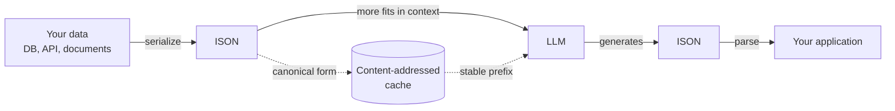
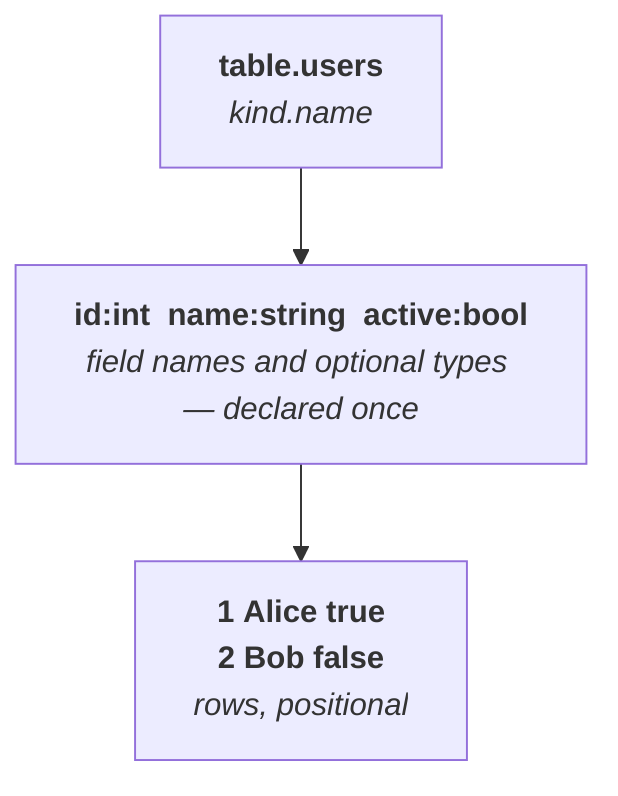
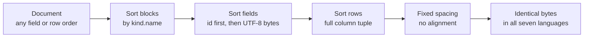
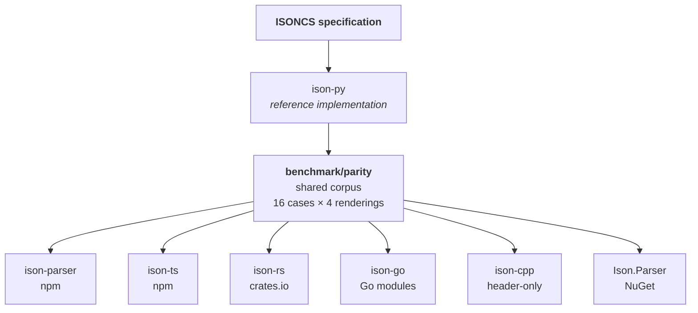

<p align="center">
  
</p>

<p align="center">
  <h2>A minimal, token-efficient data format optimized for LLMs and Agentic AI workflows.</h2>
</p>

<p align="center">
  <a href="https://github.com/ISON-format/ison/releases"></a>
  <a href="https://opensource.org/licenses/MIT"></a>
  <a href="https://www.npmjs.com/package/ison-parser"></a>
  <a href="https://pypi.org/project/ison-py"></a>
  <a href="https://crates.io/crates/ison-rs"></a>
</p>

<p align="center">
  <a href="https://www.ison.dev">www.ison.dev</a> &nbsp;•&nbsp;
  <a href="https://www.getison.com">Documentation</a> &nbsp;•&nbsp;
  <a href="https://www.ison.dev/spec.html">Specification</a> &nbsp;•&nbsp;
  <a href="benchmark/BENCHMARK_300.md">Benchmarks</a>
</p>

---

## You are paying for punctuation

Every time you send data to a language model, you pay by the token. JSON spends
a remarkable share of those tokens on syntax that carries no information — the
same key repeated on every record, braces, colons, quotation marks.

Here is the same data twice.

```
JSON — 87 tokens                    ISON — 34 tokens
─────────────────                   ─────────────────
{                                   table.users
  "users": [                        id:int name:string email active:bool
    {                               1 Alice alice@example.com true
      "id": 1,                      2 Bob bob@example.com false
      "name": "Alice",              3 Charlie charlie@example.com true
      "email": "alice@example.com",
      "active": true
    },
    {
      "id": 2,
      "name": "Bob",
      "email": "bob@example.com",
      "active": false
    },
    {
      "id": 3,
      "name": "Charlie",
      "email": "charlie@example.com",
      "active": true
    }
  ]
}
```

Three records. The field names appear **once** instead of three times. Nothing
was abbreviated and nothing was lost — and the result is still something you can
read over someone's shoulder.

Across a 300-question benchmark that came to **72% fewer tokens than JSON**,
with accuracy holding at 88%.

## Why a model reads this well

The instinct is that a denser format must be harder for a model to parse. The
opposite turned out to be true, and the reason is mundane.

Language models have seen tables billions of times: CSV, markdown tables, SQL
result sets, spreadsheet dumps. A header row followed by aligned data rows is
one of the most familiar shapes in the training distribution. ISON leans on that
familiarity instead of inventing syntax to be learned.

Deeply nested JSON asks a model to track brace depth across a long span of text
— exactly the bookkeeping that degrades with distance.



## Where it earns its place

- **Multi-agent systems** — agents pass state constantly; every message is tokens
- **RAG pipelines** — more retrieved context in the same window
- **Graph databases** — references (`:id`) are first-class, so edges stay compact
- **Function calling** — structured arguments without brace-counting
- **Long-running agents** — canonical form keeps prompt prefixes byte-stable, so caches actually hit

---

## Quick start

```bash
npm install ison-parser        # JavaScript
npm install ison-ts            # TypeScript
pip install ison-py            # Python
cargo add ison-rs              # Rust
go get github.com/ISON-format/ison/ison-go
dotnet add package Ison.Parser # C#
# C++ is header-only — copy include/ison_parser.hpp
```

```python
from ison_parser import loads, dumps

doc = loads("""
table.users
id:int name:string active:bool
1 Alice true
2 Bob false
""")

print(doc["users"].rows[0])     # {'id': 1, 'name': 'Alice', 'active': True}
print(dumps(doc))               # back to ISON
print(doc.to_json())            # or to JSON
```

Every implementation exposes the same shape: `loads` / `dumps`, plus
`loads_isonl` / `dumps_isonl` for the streaming form.

---

## The format in one screen

```
# Comments start with #

table.users                            # Block header: kind.name
id:int name:string email active:bool   # Fields, with optional types
1 Alice alice@example.com true         # Rows, space-separated
2 "Bob Smith" bob@example.com false    # Quote anything containing spaces
3 ~ ~ true                             # ~ or null for null

table.orders
id user_id product
1 :1 Widget                            # :1  → reference to id 1
2 :user:42 Gadget                      # :user:42 → namespaced reference

object.config                          # Single-row block
key value
debug true
---                                    # Summary separator
count 100
```

Anatomy of a block:



### Features

| Feature | Description |
|---|---|
| **Tables** | Structured data with typed columns |
| **Objects** | Single-row key-value blocks |
| **References** | `:id`, `:type:id`, `:RELATIONSHIP:id` |
| **Type annotations** | `field:int`, `field:string`, `field:bool`, `field:float` |
| **Computed fields** | `field:computed` for derived values |
| **ISONL streaming** | Line-based format for large datasets |
| **JSON export** | Convert in either direction |
| **Round-trip** | Parse and serialize without data loss |
| **ISONCS** | Deterministic output for content addressing and caching |

### ISONL — the streaming form

For data too large to hold at once, every line stands alone:

```
table.users|id name email|1 Alice alice@example.com
table.users|id name email|2 Bob bob@example.com
```

Same data, same types — but you can process it a line at a time, or append
forever without rewriting a header.

---

## ISONCS — the same data always produces the same bytes

Two programs holding identical data should produce identical output. That sounds
obvious, and it is surprisingly easy to get wrong: hash maps iterate in arbitrary
order, so field order drifts between languages and between runs.

**ISON Canonical Serialization** removes every degree of freedom:



Which buys three things:

| Property | What it enables |
|---|---|
| **Byte-identical output** | Hash a document to address it — equal data, equal hash |
| **Stable prefixes** | LLM prompt caches hit instead of missing on reordered fields |
| **Meaningful diffs** | Version-control your data without spurious churn |

```javascript
import { loads, dumpsCanonical } from 'ison-parser';

// Built in different orders, byte-identical output
dumpsCanonical(loads("table.users\nid name\n2 Bob\n1 Alice"))
// table.users
// id name
// 1 Alice
// 2 Bob
```

The rules, in full:

- Blocks sorted ordinal-string by `kind.name`
- Fields sorted by **UTF-8 bytes**, with `id` hoisted first when present
- Rows sorted on the **full canonical column tuple**, nulls last at every position
- Single-space delimiter, no alignment, no comments
- Idempotent — `dumps_canonical(parse(dumps_canonical(doc))) == dumps_canonical(doc)`

Sorting by UTF-8 bytes rather than native string order is the subtle part.
UTF-16 languages order astral characters differently, so `"Ａ"` (U+FF21) and
`"😀"` (U+1F600) would otherwise sort one way in Python and the other in
JavaScript. Every implementation is checked against a shared corpus that pins
exactly this.

See the **[ISONCS specification](ISONCS.md)** for the complete rules.

---

## Seven implementations, one output



Every implementation runs that corpus on every build. A divergence in any
language fails that language's test suite — parity is enforced, not assumed.

### Parsers

| Language | Package | Validation | Tests |
|---|---|---|---|
| Python | [ison-py](https://pypi.org/project/ison-py) | built in — `ison_parser.validation` | 234 |
| JavaScript | [ison-parser](https://www.npmjs.com/package/ison-parser) | built in — `ison-parser/validation` | 194 |
| TypeScript | [ison-ts](https://www.npmjs.com/package/ison-ts) | built in — `ison-ts/validation` | 156 |
| C# | [Ison.Parser](https://www.nuget.org/packages/Ison.Parser) | — | 160 |
| Go | [ison-go](https://pkg.go.dev/github.com/ISON-format/ison/ison-go) | built in — `ison-go/validation` | 93 |
| Rust | [ison-rs](https://crates.io/crates/ison-rs) | [isonantic-rs](https://crates.io/crates/isonantic-rs) | 31 |
| C++ | ison-cpp | isonantic-cpp | 102 parity checks |

### Tools

| Package | What it does |
|---|---|
| [ison-cli](https://pypi.org/project/ison-cli) | `ison` — convert, validate and inspect from the shell |
| [ison-lang](https://marketplace.visualstudio.com/items?itemName=ison-dev.ison-lang) | VS Code syntax highlighting and snippets |
| [n8n-nodes-ison](https://www.npmjs.com/package/n8n-nodes-ison) | n8n workflow automation node |

---

## Validation is built in

Define a schema, get typed rows and real error messages:

```python
from ison_parser.validation import TableModel, Field

class User(TableModel):
    id = Field(int, required=True)
    name = Field(str, min_length=1)
    active = Field(bool, default=False)

users = User.parse(doc["users"])   # validated and typed
```

The same API exists in JavaScript, TypeScript and Go. Rust and C++ keep
validation in companion packages, because their module systems make merging it
awkward.

---

## Benchmarks

300 questions across 20 datasets, measured with the GPT-4o tokenizer
(`o200k_base`):

| Format | Tokens | vs JSON | Accuracy | Accuracy / 1K tokens |
|---|---|---|---|---|
| **ISON** | **3,550** | **−72.0%** | 88.3% | **24.88** |
| TOON | 4,847 | −61.7% | 88.7% | 18.29 |
| JSON (compact) | 7,339 | −42.1% | 89.0% | 12.13 |
| JSON | 12,668 | baseline | 84.7% | 6.68 |

The accuracy column is the one worth dwelling on: ISON stays within a point of
JSON while using a fraction of the budget. Density did not cost comprehension.

**[Full methodology](benchmark/BENCHMARK_300.md)** — including how the questions
were generated and why accuracy-per-token is the metric that matters.

---

## Development

```bash
git clone https://github.com/ISON-format/ison.git
cd ison

cd ison-py    && pip install -e ".[dev]" && pytest        # Python
cd ison-js    && npm install && npm test                  # JavaScript
cd ison-ts    && npm install && npm test                  # TypeScript
cd ison-rust  && cargo test                               # Rust
cd ison-go    && go test ./...                            # Go
cd ison-cs    && dotnet test                              # C#
cd ison-cpp   && mkdir build && cd build && cmake .. && cmake --build . && ctest
```

Cross-language parity, beyond each suite's own corpus checks:

```bash
python benchmark/parity/run_extended_parity.py
```

### Layout

```
ison/
├── ison-py/  ison-js/  ison-ts/          parsers
├── ison-rust/  ison-go/  ison-cpp/  ison-cs/
├── ison-cli/  ison-vscode/               tools
├── benchmark/
│   ├── parity/                           cross-language corpus
│   └── BENCHMARK_300.md                  token benchmark
└── ISONCS.md                             canonical serialization spec
```

---

## Contributing

ISON is a young format, and the most useful contributions are often the least
glamorous. Things that genuinely help:

**Found data that round-trips wrong?** That is the highest-value bug report
there is. Open an issue with the input and what you expected — a failing case is
worth more than a description of one.

**Add a case to the parity corpus.** [`benchmark/parity/`](benchmark/parity/) is
how seven implementations stay honest with each other. If you find an edge case
that behaves differently in two languages, a corpus case pins it forever. See
[HARNESS.md](benchmark/parity/HARNESS.md) for the available shapes.

**Port ISON to a new language.** ison-py is the reference and the parity corpus
is the acceptance test. If your port passes the corpus, it agrees with the others
by construction.

**Improve the documentation.** If something took longer to understand than it
should have, that is a documentation bug worth filing.

The usual flow:

1. Fork and branch — `git checkout -b fix/thing`
2. Add a test that fails, then make it pass
3. Run the suites for whichever implementations you touched
4. Open a pull request describing what broke and why the fix is right

One request: please keep changes to canonical output backed by a parity case.
Byte-identical output across languages is the one guarantee every implementation
must hold to.

See [CONTRIBUTING.md](CONTRIBUTING.md) for detail and
[CODE_OF_CONDUCT.md](CODE_OF_CONDUCT.md) for how we work together.

---

## License

MIT — see [LICENSE](LICENSE).

## Author

**Mahesh Vaikri**

- [www.ison.dev](https://www.ison.dev) • [www.getison.com](https://www.getison.com)
- GitHub: [@maheshvaikri-code](https://github.com/maheshvaikri-code)

---

<p align="center">
  <strong>ISON</strong> — less tokens, more context, better AI.
</p>
